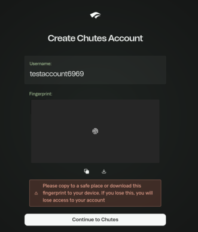

## Dependencies
Install Rust  
```sh
curl --proto '=https' --tlsv1.2 -sSf https://sh.rustup.rs | sh
```

## Setup

You can use any OpenAI compatible API, such as OpenRouter or ChutesAI.
ChutesAI is free, here's how to set it up:

Go to ```https://chutes.ai/auth/start```
Create an account, no email/password needed



Once you do that, it should look like this.

Now click "Continue To Chutes", you should be on the home page.

Click API on top, then create an API key.

Copy the key, then add it onto the .env file.

You can probably just discard the account now, there's no other use for it

Edit the .ex_env file accordingly, and copy it into a .env file  
```sh
vim .ex_env && cp .ex_env .env
```

## Startup
Execute the start.sh file  
```sh
./start.sh
```  
This'll create and start up a docker container, compile the Rust code, and hopefully run it
